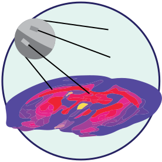

## SPUTNIK: an R package for peak selection of Mass spectrometry imaging data ##

If you find SPUTNIK useful, please consider citing our work :)

Inglese, P., Correia, G., Takats, Z., Nicholson, J. K. & Glen, R. C. (2018). SPUTNIK: an R package for filtering of spatially related peaks in mass spectrometry imaging data. Bioinformatics (Oxford, England).

### Description ###

**SPUTNIK** is an R package consisting of a series of tools to filter mass spectrometry imaging peaks characterized by a noisy or unlikely spatial distribution. SPUTNIK can produce mass spectrometry imaging datasets characterized by a smaller but more informative set of peaks, reduce the complexity of subsequent multi-variate analysis and increase the interpretability of the statistical results.

### Contact ###

- issues and bug reports: https://github.com/paoloinglese/SPUTNIK/issues
- pull requests: https://github.com/paoloinglese/SPUTNIK/pulls
- email contact: p.inglese at outlook.com

## Install from CRAN ##

To install the CRAN package, run the command:

    install.packages("SPUTNIK")

## Install from source ##

To install it, run the command:

    devtools::install_git("https://github.com/paoloinglese/SPUTNIK.git")

## Example SPUTNIK workflow on MALDI mass spectrometry imaging data

https://github.com/paoloinglese/SPUTNIK/blob/master/tutorials/workflow_maldi.html

## Example SPUTNIK workflow on DESI mass spectrometry imaging data

http://htmlpreview.github.com/?https://github.com/paoloinglese/SPUTNIK/blob/master/tutorials/workflow_desi.html
	
## Example data ##

Two mass spectrometry imaging datasets in RData format are available in a separate repository:

https://github.com/paoloinglese/SPUTNIKexamples

	

